#  
## 경조사 통합 관리 서비스 - ULMA
### '일정 관리와 경조사비 추천, 관리 및 자체 페이 서비스를 가진   경조사 통합 관리 어플리케이션' 입니다.
### [Notion](https://www.notion.so/8f23b33f7aea4859b655a5b55c91d2cb?v=145d7dda60ce46e39aa2af6bea2ac577&pvs=4) / [Figma](https://www.figma.com/design/Vxu9ayRQKiPkow5oTfO1Ya/Wireframe?node-id=107-1278&node-type=canvas&t=IaLu2nuejIBzIQTS-0) / [UCC](https://youtu.be/aRD3NnUMwj8) / [GitLab](https://lab.ssafy.com/s11-fintech-finance-sub1/S11P21E204)

### 기획 배경
- **복잡고 귀찮은 장부 어떻게 관리하시나요 ?** 
    : 수기로 작성된 장부를 관리하고 개인 계좌를 통한 입출금 내역을 따로 관리하는게 너무 힘들어요.

- **얼마가 적당할까 ?**  
    : 친밀도나 사회적 관계를 고려한 적정 금액이 얼마인지는 너무 애매해요.

- **너무 번거롭지 않으신가요 ?** 
    : 메신저를 통해 일정 전달 받고, 캘린더에 등록하고, 은행 어플에서 이체하는 과정이 번거로워요.

- **동명이인은 어떻게 구분하나요 ?**  
    : 기존 서비스는 동명이인 구분 처리가 되지 않아요.

### 목적
경조사 통합 관리 서비스는 이러한 문제를 해결하고자 합니다. 
  본 프로젝트의 주요 목적은 다음과 같습니다.
- **경조사 일정 통합 관리**    
: 사용자가 참석 또는 주최했거나 예정되어 있는 경조사 일정과 각 경조사 별 거래내역 등 상세 정보를 확인을 통한 사용자 편의성 향상하고자 합니다.

- **편리한 데이터 관리** 
  : 수기 장부, 엑셀, 청첩장 등 다양한 문서를 어플에서 간편하게 등록, 관리할 수 있게 하고자 합니다.

- **사용자 맞춤형 지원**  
: 경조사와 관련된 다양한 상황에서 적정 금액 추천, 적절한 메세지 추천을 통해 경조사에 대한 사용자의 부담을 줄이고자 합니다.

<!-- ## 📓 목차
1. [⭐ 팀원 및 역할 ⭐](#🦸-팀원-및-역할)
2. [⭐ 기술 스택 및 설계 내용 ⭐](#📚-기술-스택-및-설계-내용)
3. [⭐ 크롤링을 통한 데이터 수집 ⭐](#💾-크롤링을-통한-데이터-수집)
4. [⭐ 카드 상품 추천 알고리즘 ⭐](#💳-카드-상품-추천-알고리즘)
5. [⭐ AI 적용 내용 ⭐](#🧭-ai-적용-내용) 
6. [⭐ 주요 기능 소개 ⭐](#🧰-주요-기능-소개)  -->

## 🦸 팀원 및 역할

|이름|역할 및 구현 기능|한일|
|---|---|---|
|이유찬 (팀장)|**Front End** |- 유저 관련 기능 구현  : 로그인, 회원가입, 회원탈퇴, 회원정보 수정 플로우 설계 및 구현 : 회원 탈퇴 및 회원 정보 수정 인터페이스 구축 : JWT 기반 인증 및 사용자 세션 관리     - 지인 관리 기능 구현  : 핸드폰 연락처 연동 : 동명이인 관리 및 중복 처리 로직 설계 : 사용자 검색 및 필터링 기능 추가  - 일정 관리 기능 구현 : 캘린더 기능 구현 (일정 등록, 수정, 삭제 기능 포함) : 사용자별 맞춤형 일정 알림 기능 추가  - UI/UX 디자인 수정 : 전반적인 UI/UX 리팩토링 및 접근성 개선 : 반응형 디자인 최적화 및 사용자 경험 향상  - 발표 자료 제작, 발표|
|윤예리 (팀원)|**Front End** |- 일정 관련 기능 구현  : 캘린더 구현, 일정 등록, 수정, 삭제   : OCR 간편 등록 기능 : OCR데이터 파싱 자체 알고리즘 제작   - PAY 기능 구현 : 간편이제, 계좌연동, PAY 충전   - UI/UX디자인 수정 : 전반적인 UI/UX 리팩토링 및 접근성 개선 : 반응형 디자인 최적화 및 사용자 경험 향상  -  와이어프레임, 발표자료 제작|
|윤동환 (팀원)|**Front End** |- Event 관련 기능 구현  : 이벤트 등록, 수정 삭제 : 캘린더 구현 : EXCEL 파싱 통한 거래내역 자동 등록 기능 구현   - AI 추천 기능 구현 : 경조사비 적정 금액 추천 기능 : 경조사 메세지 추천 기능 : 챗봇  형식 구현  - UI/UX 디자인 수정 : 전반적인 UI/UX 리팩토링 및 접근성 개선 : 반응형 디자인 최적화 및 사용자 경험 향상   - 와이어프레임 제작  - README파일 작성|
|권대호 (팀원)|**Back End** |- 데이터 모델링   - USER관련 기능 구현   - 테스트 환경 설정 및 버그 수정|
|최 민 (팀원)|**Back End**| - 이벤트, 일정, 지인 관련 API CRUD 구현  - Apache POI 사용한 엑셀 파일 파싱   - 스케줄러 코드 작성  - UCC 제작|
|이승민 (팀원)|**Back End**  **Infra** |- Infra  : docker, jenkins 활용 CI/CD 환경 구축 : sonarqube연동 통한 코드 품질 관리  : DB 이중화 통한 성능 개선   -BackEnd  : REST API 통신 구축 : 시스템 안정성 보장 위한 예외처리 로직 구현  : JWT통한 사용자 인증 처리   : 멀티모듈, DB분리   : JOOQ를 통한 쿼리 작성 및 유지 보수   : 포팅매뉴얼 제작|

## 📚 기술 스택 및 설계 내용

#### 시스템 아키텍쳐
> 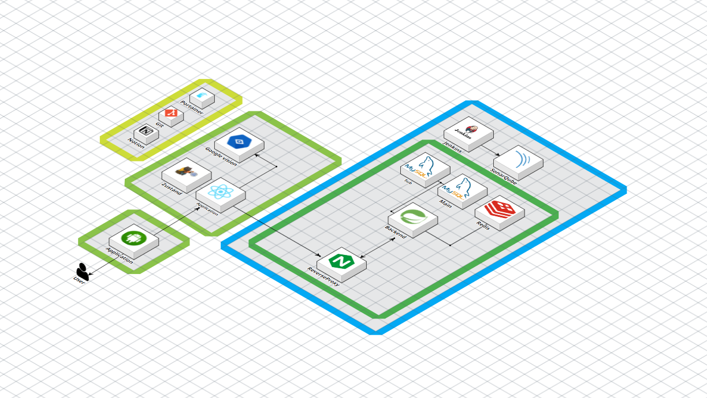

#### 협업툴

>|  GitLab   |     Jira      |     Notion     |    Figma    | Mattermost, Webex |
>| :-------: | :-----------: | :------------: | :---------: | :---------------: |
>| 버전 관리 | 프로젝트 관리 | 공용 문서 관리 | 디자인 협업 | 연락 및 화상회의  |
#### FrontEnd - React Native (TypeScript)
>
> | React Native | Node.js | TypeScript | Android Studio | SDK Platform | VS code |
> | :----------: | :-----: | :--------: | :------------: | :-: | ------- |
> |    0.72.6    | 20.17.0. |   4.8.4    |    Dolphin     | Inter x86_64 Atom System Image (ver13, ver14)  | 1.73.1  |  

> | React | Chocolatey | Device |Zustand |
> | :----------: | :-----: | :--------: | :--------: | 
> |   18.2.0    | 20.17.0. |   Pixel 5 Tiramisu(API33)    |  4.5.5 |
#### Back End 
>
> | JAVA | springboot security | Jooq | gradle | intellij IDEA | 
> | :----------: | :-----: | :--------: | :------------: | :-: | 
> |    21.0.4(corretto-21)    |  3.3.3 |    3.3.3    |    8.8     | 2024.1.4  |   

### 💎 설계 내용
## FRONTEND 
## 📘 [PageLayout](https://www.figma.com/design/Vxu9ayRQKiPkow5oTfO1Ya/Untitled?node-id=0-1&t=0QXs0n48RMa0l2DJ-1)

## 📘 [API 명세서](https://www.notion.so/API-a12b3a13513844108f1d2ff5ebcc1d9f?pvs=4)
## 📘 [기능 명세서](https://www.notion.so/28bb81a245f44fb4891a5e2caa88a9cd?pvs=4)
## 📘 [FE 매뉴얼](https://www.notion.so/FE-b4279394b6594440b3d9cb11db540511?pvs=4)
 

## BACKEND
## 📘 [ERD](https://www.erdcloud.com/d/sDtZSuYoAz7xtpXMB)
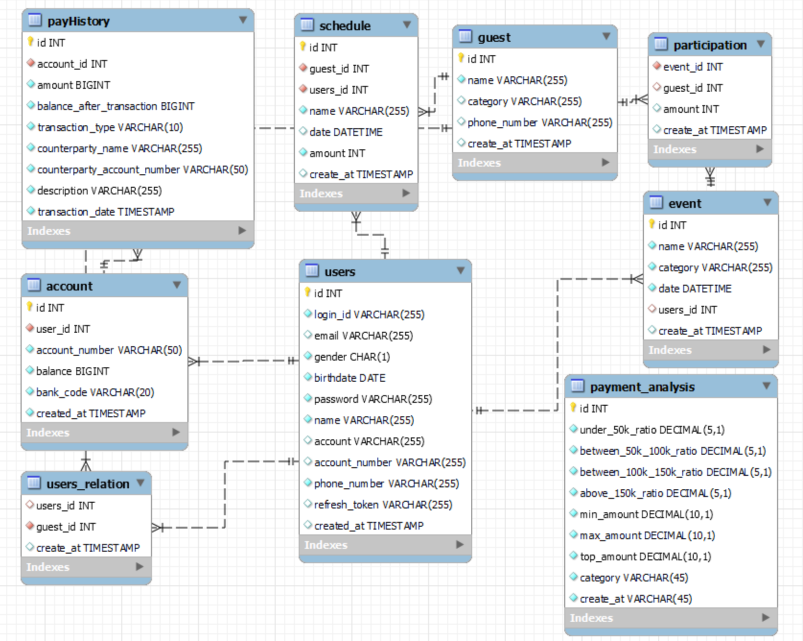
## 📘 [시퀀스 다이어그램](https://www.notion.so/271be23782a741fd8d654d77e982c5c4?pvs=4)
## 📘 [BE 매뉴얼](https://www.notion.so/BE-4b1951c082384ecf9fd335e8f9f3c92f?pvs=4)
## 📘 [BE 특징](https://www.notion.so/Back-End-b57be711f28d46309a642417cb432323?pvs=4)
 

## Infra
## 📘 [Infra 매뉴얼](https://www.notion.so/Infra-67bbb2e22d7544378123c59267cd7729?pvs=4)
 

# 🔖 **주요 기능**
### **랜딩 페이지**
<table>
  <tr>
    <th>랜딩 페이지</th>
  </tr>
  <tr>
    <td></td>
  </tr>
</table>

### **메인 페이지**
<table>
  <tr>
    <th>메인페이지</th>
    <th>추가 페이지</th>
  </tr>
  <tr>
    <td>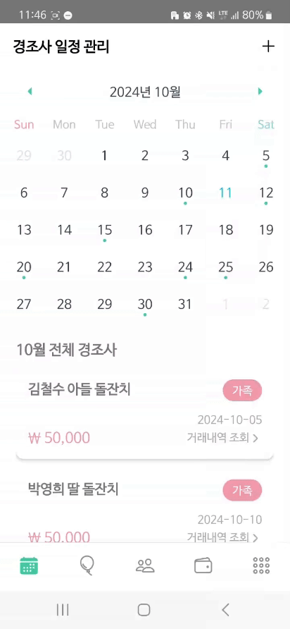</td>
    <td></td>
  </tr>
</table>

- `캘린더`: 월 별, 일 별 일정 조회, 거래내역 확인 가능
- `일정 추가`: 메인 페이지에서 바로 접근 가능하게 함으로서 사용자 편의 향상

### **이벤트 관리 페이지**
<table>
  <tr>
    <th>이벤트 목록, 관리</th>
    <th>이벤트 상세 내역 등록</th>
    <th>OCR 등록</th>
  </tr>
  <tr>
    <td></td>
    <td>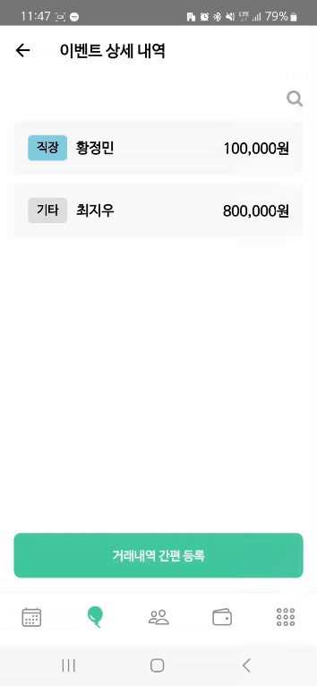</td>
    <td>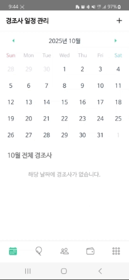</td>
  </tr>
</table>

- `이벤트 관리`: 이벤트 별 거래내역 확인 및 수정
- `이벤트 추가`: 카테고리 구분 등록, 이벤트 일정 상세 등록, OCR 간편등록
- `이벤트 거래내역 추가` : 엑셀, 계좌 거래 내역 등을 통한 간편한 등록
- `사용자 편의 향상`  : 이벤트 카테고리 분류와 카테고리 별 색상 지정으로 가시성 향상   : 기타 카테고리 부여와 시간 입력 선택지 부여로 사용자 자유도 향상
- `스와이프 제스처`   : 스와이프를 통한 수정, 삭제로 작업 속도 향상, 화면 공간 절약, 직관적 인터페이스 제공   이를 통한 사용자 경험 향상

### **지인 관리 페이지**
<table>
  <tr>
    <th>지인 관리</th>
    <th>지인 등록</th>
    <th>지인 검색</th>
  </tr>
  <tr>
    <td>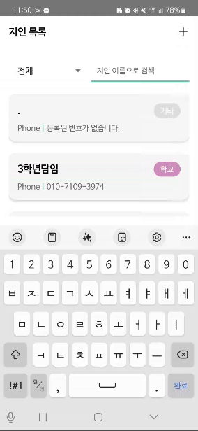</td>
    <td>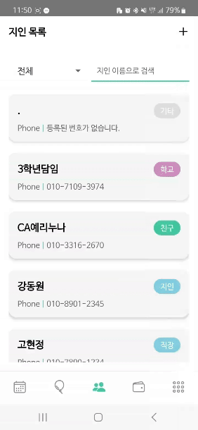</td>
    <td>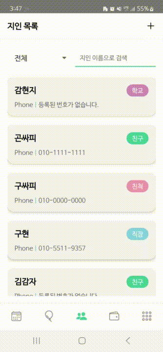</td>
  </tr>
</table>

- `지인 관리`: 지인 정보 수정 및 삭제
- `지인 등록`: 연락처, 지인 목록 동기화  동명이인 관리

### **PAY 페이지**

<table>
  <tr>
    <th>PAY 충전</th>
    <th>PAY 송금</th>
  </tr>
  <tr>
    <td>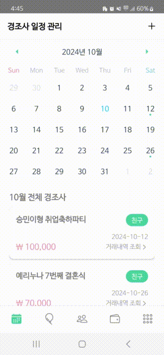</td>
    <td>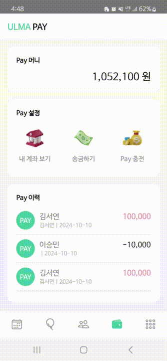</td>
  </tr>
</table>

- `PAY 충전`: 등록된 계좌를 통한 PAY충전
- `PAY 송금`: 자체 PAY 서비스를 통한 송금 & 이력 확인

### **추천 서비스**

<table>
  <tr>
    <th>AI 금액 추천</th>
    <th>AI 메세지 추천</th>
  </tr>
  <tr>
    <td>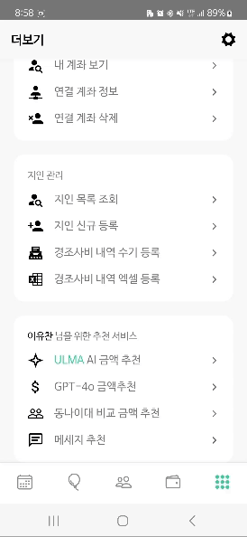</td>
    <td>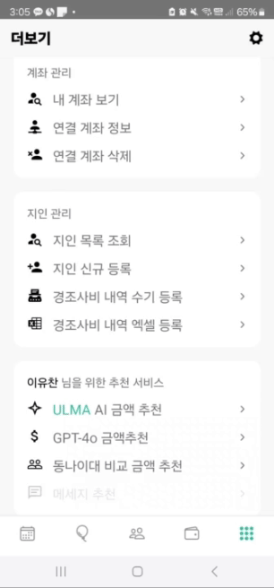</td>
  </tr>
</table>

- `AI금액 추천 ` : 행사 종류, 주최자와의 관계, 소득, 연령을 고려한 적정 금액 추천  : 대화 형태로 필요 정보 입력 유도해 사용자 경험 향상 
- `AI메세지 추천` : 행사 종류, 주최자와의 관계, 연령을 고려한 경조사별 적정 메세지 추천   : 대화 형태로 필요 정보 입력 유도해 사용자 경험 향상   : 개인화된 경험 제공

 